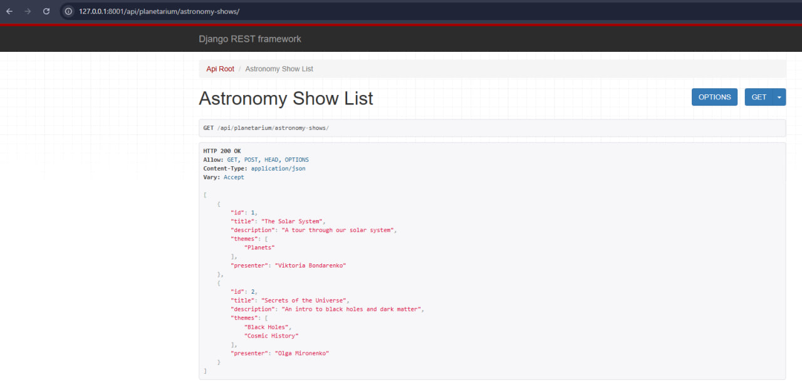
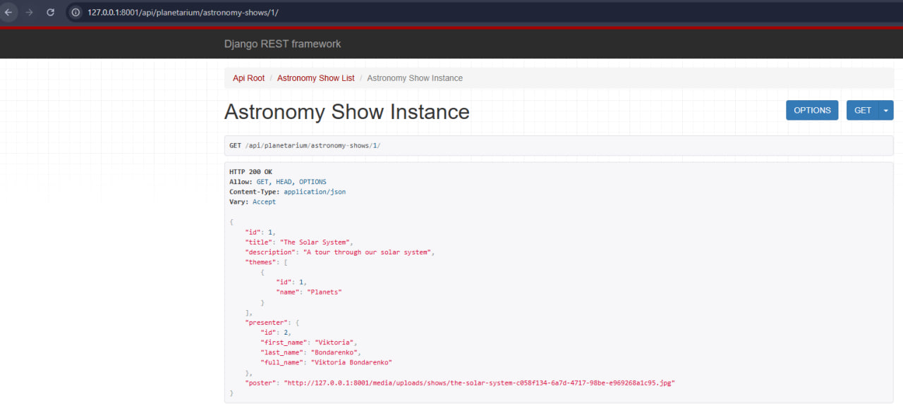
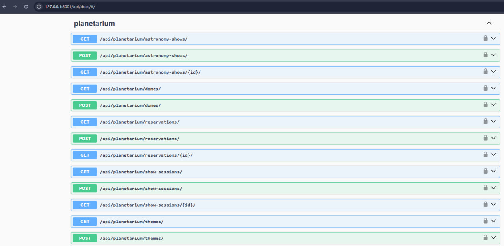
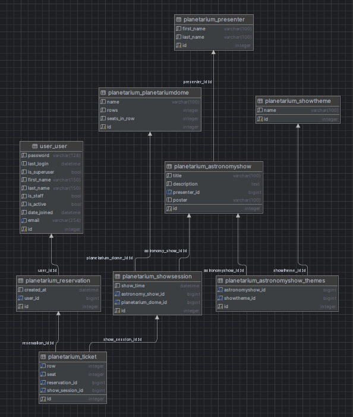

# 🌌 Planetarium API

**Planetarium API** is a Django REST Framework project for managing astronomical shows, domes, sessions, reservations, and tickets in a planetarium environment. The API supports user roles, permissions, validation, and flexible querying — all containerized with Docker.

---

## 🚀 Features

- Full CRUD for:
  - Astronomy Shows
  - Show Themes
  - Planetarium Domes
  - Show Sessions
  - Reservations and Tickets
- Custom permissions:
  - Users can manage only their own reservations and tickets
  - Admins have full control over all models
- Validation logic:
  - Prevents booking tickets for past sessions
  - Prevents duplicate seat reservations within the same session
- Search and filtering by date, status, dome, etc.
- JWT authentication
- Auto-generated Swagger / OpenAPI schema

---

## 🛠️ Tech Stack

- Python 3.10
- Django 5.2
- Django REST Framework
- PostgreSQL
- Docker & Docker Compose
- drf-spectacular (OpenAPI schema)
- Simple JWT (authentication)
- python-dotenv

---

## 🐳 Running the Project with Docker

### 1. Clone the Repository

```bash
git clone https://github.com/<your-username>/planetarium-api.git
cd planetarium-api
```

### 2. Create `.env` file

Create a `.env` file in the root of the project:

```
DEBUG=True
SECRET_KEY=your_secret_key_here
POSTGRES_DB=planetarium
POSTGRES_USER=planetarium_user
POSTGRES_PASSWORD=planetarium_pass
POSTGRES_HOST=db
POSTGRES_PORT=5432
```

> 🔑 Replace `SECRET_KEY` with a secure Django key.

### 3. Build and Run Containers

```bash
docker-compose up --build
```

The API will be available at:

📍 http://localhost:8000

---

## 🔐 Authentication

JWT-based authentication:

- `POST /api/token/` — obtain access and refresh tokens
- `POST /api/token/refresh/` — refresh the access token

Add `Authorization: Bearer <your_access_token>` to access protected endpoints.

---

## 📚 API Documentation

- Swagger UI: [http://localhost:8000/api/docs/](http://localhost:8000/api/docs/)
- OpenAPI schema (JSON): [http://localhost:8000/api/schema/](http://localhost:8000/api/schema/)

---

## 🧪 Running Tests

To run tests inside the Docker container:

```bash
docker-compose exec app python manage.py test
```

---

## 📸 Screenshots







---

## 📊 DB Structure


